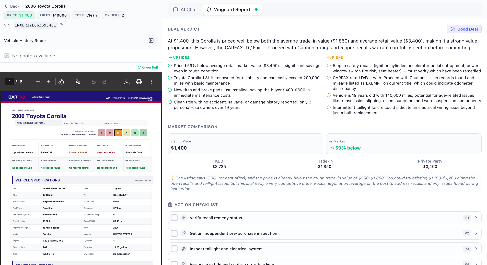
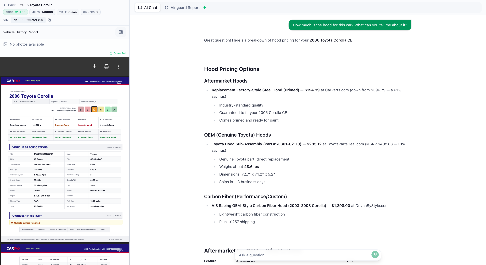
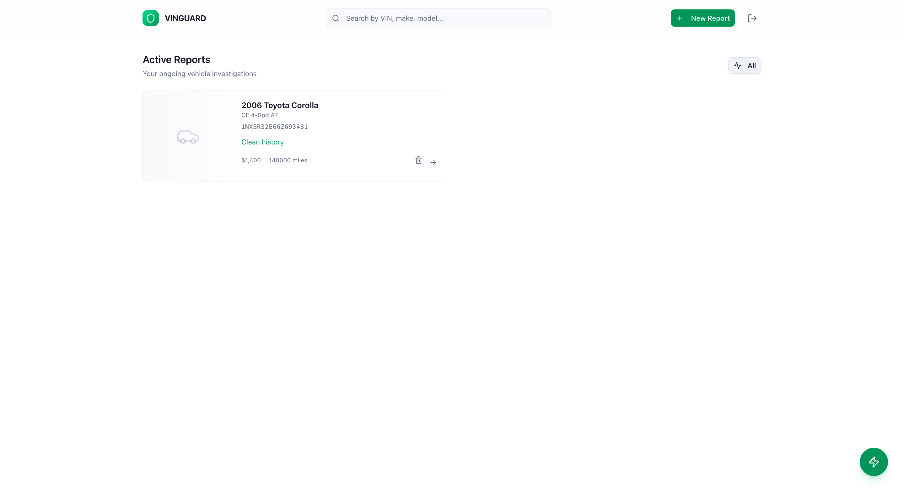
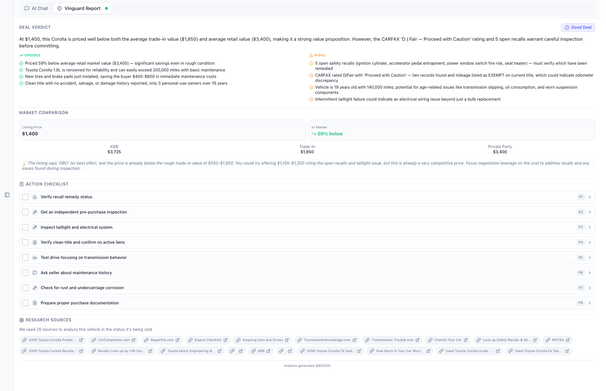

# Vinguard

In-depth Facebook Marketplace vehicle listing review app. Try it out for free at [vinguard.com](https://www.vinguard.app/)

## Demo

<div style="display: flex; gap: 10px;">
  
  
</div>

<div style="margin-top: 10px;">
  
  
</div>

## Repository Layout

`backend/`: Hono + tRPC API, SQLite, Palantir Foundry

`frontend`: Vite + React + TanStack Query + tRPC client

Deeper architecture notes live in [`backend/docs/`](backend/docs/README.md).

## Prerequisites

- [Bun](https://bun.sh) (used for install scripts and the backend runtime)
- [Palantir Foundry Account](https://www.palantir.com/platforms/foundry/) (Ontology used for data management & governance, serverless LLM actions are used as well)

## First-time setup

1. **Backend environment**  
   `cd backend && cp .env.example .env`  
   Fill .env with your credentials

2. **Frontend environment**  
   `cd frontend && cp .env.example .env`  
   Point `VITE_API_URL` at your backend API url (default `http://localhost:3000/trpc`).

3. **Install dependencies** (each app has its own `node_modules`):

   ```sh
   cd backend && bun install
   cd ../frontend && bun install
   ```

## Running locally

You need **two backend processes** plus the **frontend** for the full flow (reports enqueue analysis jobs on the worker).

```sh
# TRPC API
$ cd backend && bun run dev

# Worker (processes generate_analysis jobs)
$ cd backend && bun run worker

# Frontend
$ cd frontend && bun run dev
```

## Further reading

- [`backend/README.md`](backend/README.md) — scripts, env, tests, Docker
- [`frontend/README.md`](frontend/README.md) — build, preview, env
